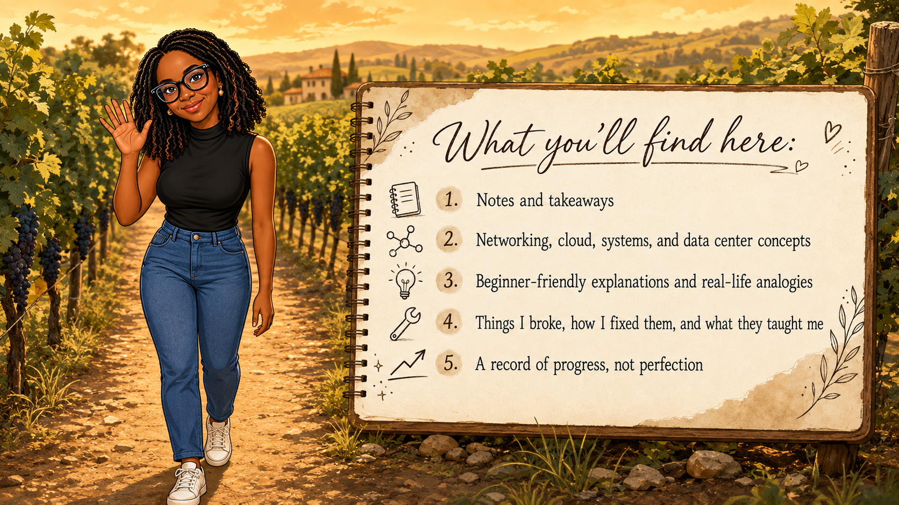

  

Hi, I'm Jamie 👋🏾

Welcome to the place where I document the moments that make me stop and say:

“Ohhh... now I get it!”

So, this is sort of part lab, part notebook, and part tech brain dump.

I created this space to make sense of what I am learning along the way. My goal is not just to memorize technical terms. I want to understand how the pieces connect, explain them in plain language, and build the confidence to apply them.

  

 

This GitHub is not a collection of everything I know. It is a record of everything I am learning.

Thanks for stopping by. Feel free to explore, learn with me, or share a better way to understand something.
